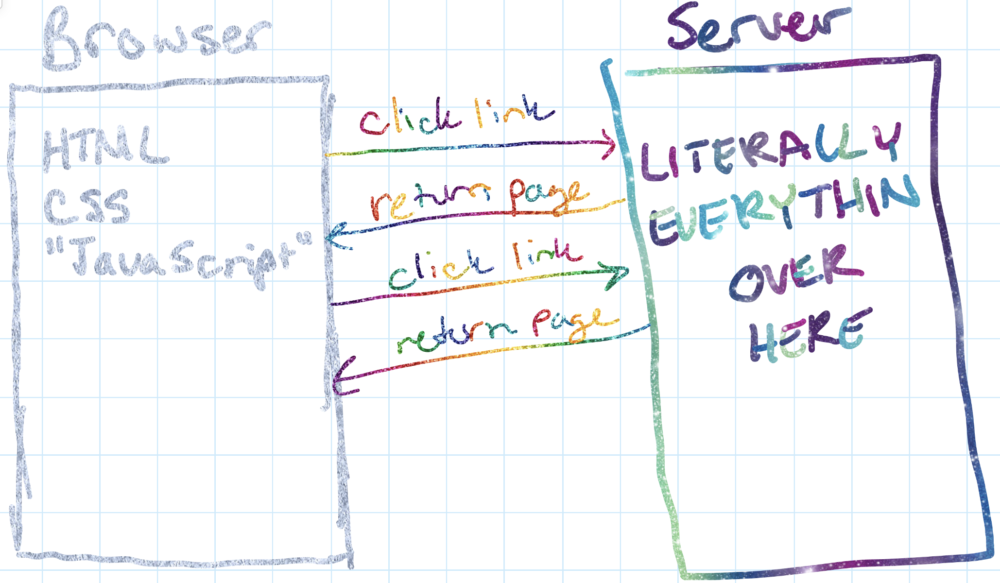

footer: NEJS 2019 -- @nodebotanist
slidenumbers: true

## V8, WebAssembly, and the **Future of JS and a Multi-Language Web**

^Today, I'm here to talk about something I'm super excited about, and I hope by the end, you will be too

---

## About Me


* Robotics Author/Addict
* Developer 🥑@ CloudFlare
* Twitch streams hardware/software @nodebotanist

^Written 2 books on IoT with JavaScript

---


---

#[fit] What even is **WebAssembly**?

^I find the best way to start saying what Web Assembly is by saying what it isn't

---

# What WebAssembly is **NOT**

* just a programming language or instruction set (it's so much more than that)
* the death of JS (probably)
* something you can just ignore cause it's gonna go away


^There are toolchains that we'll talk about later that will explain what I mean
LinkedIn will be asking for 5 years WebAssembly programming exp in about 6 months
This is such a big thing that you cannot ignore it in the long run

---

# What WebAssembly **IS**

* A compilation target for other languages to compile to, as well as a language in itself
* An augmentation of the abilities of JS by allowing other languages to operate in the browser
* But most importantly...

^You CAN write WebAssembly code, but you can also compile to it in other languages.
This can forever change how we code for the browser.

---

* Pretty literally\* **magic(k)**


\* - no not really literally but I'll explain later

---

# WebAssmebly is a **compilation target**

* You write code in other languages and compile them into WebAssembly
* Rust, C/C++, Go, C#; these are just a few of the languages with WebAssembly as a compile target

^Because why re-write codebases when you can just compile them to a new target?

---

## But the question you then have to ask is...

---


---


---

## There are *so many reasons* you would want this in your life

---

# THIS IS **A NEW ERA FOR THE WEB**

^I'm not exaggerating, or playing it up. This brings a real shift in how we code for the web

---


---

# No but seriously

WebAssembly is comparable to bringing the power of the JVM and the subsequent LLVM toolchain **into the browser**, creating an **evolution of the web as we know it**.


^Compare LLVM to toolchains like wasm-pack and Blazor

---


^Okay, you're with me a little, so let's look at some pictures that will help me explain.

---

# Ancient.png



^ Everything is on the server, and new information requires a refresh of the entire page

---

# Then.png


^ Ajax allowed us to build real applications on the web, and business logic started to distribute itself between client and server

---

# Now.png


^Between Service Workers and WebAssembly, we can do so much so quickly in the browser
The "server" in this picture is just as likely a cluster of serverless functions

---


^"Ok, great, thanks Kas, but why do  I care?"

---

# Why does this matter?

* Augmenting JS at its not-so-strong points
* Not rewriting entire codebases to use them on the web
* Fewer calls to the server, less latency, faster web apps

^ Fewer calls to the server because Web Assembly lets us do more work in the browser

---

# Augmenting JS at its not-so-strong points

Who wants to write a banking app in JS?

If you're running *anything that relies on mathematical numerical accuracy or speed* that meant, until now, another AJAX call to have another language do alllllllll the math. *With WebAssembly*, we can do this in the browser, with, say, Rust.

---

# Other JS not-so-strong points

* Type coercion side-effects: `"" == 0 //true`
	* Especially the acciedental concat when you meant to add and vice versa.
* Anything that has to do with types:

```
typeof [] === 'Array' //false...
```

^Yes, I am aware TypeScript exists. There's even a Web Assmebly compiler for it!

---

## Using WebAssembly means *using the right tool for the job*

---

# BUT THIS WILL KILL JS!!!


^With all the love in the world I say JS is the cockroach of languages.

---

# Probably not-- for most situations, it **makes JS better by letting it do what it is good at and ignoring the rest**.

However, WASM toolchains are gaining more and more abilities by the day, and some teams would like to have WASM be able to do everything JS does.

** - there are WebAssembly modules that can access the DOM and be used to manipulate the shadow DOM.

^We are waltzing towards a showdown between those who would have wasm do everything and those that would have wasm as augmentation. See me after if you want to learm more.

---

## It *makes the web better* by creating better browser experiences


^Creating faster experience with less latency means we can do more!

---

# Let's *take a closer look* with a demo

---

# The Demo

* uses wasm-imagemagick
* manipulates images in the browser up to 10x faster than JS can
* Shows the real power of not having to rewrite code and being able to let us use the right tool for the job

---

# But what about *Node.JS*?

---

# Wait...

---

# What *ABOUT* Node.JS?!?!


---

# Native. Heccin. Modules.


---

# Why native modules are such a pain

* They have to be compiled on download for the architecture you're installing on
* They either have to compile on every platform OR leave off platforms from support
* Node-Gyp (disclaimer: I respecc the hecc out of their work.)

^ Native modules are code in other languages that Node interfaces with
^ Right now, when you npm i your native modules, they download and compile the source on your machine

---

# WebAssembly *Works on Node >= 8.0*

---


---

# WebAssembly Modules in Node.JS

* Are *precompiled binaries*, so they're portable to *any platform that runs Node.JS*.
* No more recompilation on every download on every architecture.
* FOR REALS.

^With Web Assembly modules, you're downloading a precompiled binary
^This means much more portability bc it runs wherever Node runs

---

> "Everyone wants to [deprecate] node-gyp and WebAssembly would [eventually] allow us to do this"
-- Laurie Voss, a few weeks ago

---

# WebAssembly is even invading serverless


---

# We have a free tier now!


(I'll show this again later)

---

# How do we get to this magickal land?

* If you'd like to learn Rust,  you can read the Rust Book and the Rust-wasm book:
* Rust book: https://doc.rust-lang.org/book/
* Rust-wasm book: https://rustwasm.github.io/book/
* If you'd like to use C/C++, check out https://emscripten.org
* C# fan? Try https://github.com/aspnet/Blazor
* Fan of some other language? Search the web-- It's probably in the works

^There's even one for PHP...? 

---

# The point of this talk

* Try WebAssembly (I personally really like Rust)
* WebAssembly is the future of JS in all its forms
* If you are a hiring manager; *hire someone who is different from you*. Just go and do it.

---


---

# Thanks for listening!


* kas@cloudflare.com
* @nodebotanist
* https://github.com/nodebotanist/austinjs-july-2019
